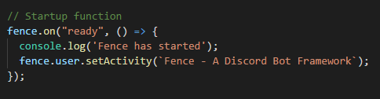

  

  
  

# Fence - A Discord Bot Framework

+ https://discordapp.com/developers/docs/intro
+ https://discord.js.org/#/
+ https://nodejs.org/en/

  

## About Fence

> **Note:** Fence is under development.

Fence is a Discord Bot framework running on Node.JS using Discord.JS.

To:
- Create custom Discord Bots faster
- To skip the startup hassle
>>
